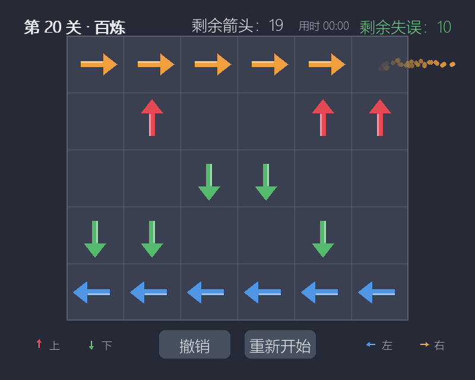

# 一箭又一箭（Arrow by Arrow）

一款用 Python + Pygame 开发的点击式箭头解谜小游戏。观察箭头的方向与相互阻挡关系，按正确的顺序点击箭头，让它们全部飞出棋盘！

软件工程课程个人作业项目，借助 AIGC（Claude Code）辅助完成。

## 游戏简介

- 棋盘为网格，格子里放着四种方向的箭头：上（红）、下（绿）、左（蓝）、右（橙）；
- 点击箭头时，程序检查它前进方向与棋盘边界之间是否还有其他箭头：
  - **前方无阻挡**：箭头沿方向飞出棋盘并消失（拖尾粒子 + 飞出动画 + "嗖"音效）；
  - **前方有阻挡**：箭头原地晃动并闪红，弹出冲击环与"失误 -1"飘字（碰撞音效），同时**消耗一次失误机会**；
- **失误次数用尽**则本关失败，可重新开始本关；**清空本关全部箭头**即通关，进入下一关；
- 共 20 个由易到难的关卡，全部通关后显示通关结果与总用时；
- 附加功能：**撤销上一步**、**每关计时**、**程序生成音效**、**开始界面漂浮箭头与入场动画**、**结果卡片弹出动画**、**失误次数分色警示（绿/黄/红）**、**方向颜色图例**。

## 开发环境

| 项目 | 说明 |
|---|---|
| 操作系统 | Windows 11（也支持其他有桌面环境的系统） |
| Python | 3.12（3.10+ 均可） |
| 依赖库 | pygame 2.6.1、pytest（仅测试用） |
| 包管理 | uv（或 pip） |
| AIGC 工具 | Claude Code |

## 安装和运行方法

### 方式一：uv（推荐）

```bash
uv sync                 # 按 pyproject.toml 自动创建虚拟环境并安装依赖
uv run python main.py   # 运行游戏
```

### 方式二：pip

```bash
pip install -r requirements.txt
python main.py
```

### 运行测试

```bash
uv run pytest                        # 单元测试 + 关卡可解性 + 渲染冒烟测试（共 30 项）
uv run python main.py --selftest     # 自动化验收：无窗口走完整流程并生成截图
uv run python levels.py              # 打印各关卡的求解器通关序列
```

### 打包为 exe（无需 Python 环境，直接发给别人玩）

```bash
uv add --dev pyinstaller
uv run pyinstaller --onefile --windowed --noconfirm --name ArrowGame main.py
```

生成的 `dist/ArrowGame.exe` 可任意改名（如"一箭又一箭.exe"），双击即可运行，无需安装 Python 或任何依赖。注意：个别杀毒软件可能对 PyInstaller 单文件 exe 误报，添加信任即可。

## 游戏操作说明

| 操作 | 说明 |
|---|---|
| 鼠标左键点击箭头 | 前方无阻挡 → 飞出消除；有阻挡 → 碰撞并扣一次失误 |
| 点击空格 / 棋盘外 | 无任何效果，不扣失误 |
| 「撤销」按钮 | 回退最近一次成功消除（栈空时置灰） |
| 「重新开始」按钮 | 重置本关盘面与失误次数 |
| F12 | 保存当前画面截图到 `screenshots/` |
| Esc / 关闭窗口 | 退出游戏 |

## 界面截图

| 开始界面 | 游戏界面（第 1 关） |
|---|---|
|  |  |

| 碰撞反馈 | 通关界面 |
|---|---|
|  |  |

| 失败界面 | 第 20 关「百炼」（6×5 大棋盘） |
|---|---|
|  |  |

| 全部通关界面 |  |
|---|---|
|  |  |

## 关卡设计

| 关卡 | 名称 | 棋盘 | 箭头数 | 失误上限 | 教学点 |
|---|---|---|---|---|---|
| 1 | 初见 | 5×4 | 6 | 5 | 基本规则，任意顺序可解 |
| 2 | 阻挡 | 5×4 | 5 | 4 | 碰撞反馈与消除顺序 |
| 3 | 连锁 | 5×4 | 6 | 5 | 同排箭头方向不同解法相反 |
| 4 | 迷阵 | 5×4 | 7 | 4 | 跨行依赖链，需要规划 |
| 5 | 收官 | 5×5 | 15 | 6 | 三排交错依赖 |
| 6 | 双链 | 5×5 | 6 | 5 | 双排反向链 |
| 7 | 塔 | 5×5 | 9 | 6 | 中央竖塔必须先拆 |
| 8 | 迷宫 | 5×4 | 9 | 6 | 纵横依赖交错 |
| 9 | 阶梯 | 6×5 | 9 | 5 | 宽盘三排阶梯 |
| 10 | 齿轮 | 5×4 | 8 | 5 | 多组短链交错 |
| 11 | 十字 | 5×5 | 9 | 6 | 十字中心竖塔 |
| 12 | 回字 | 5×5 | 11 | 7 | 口字环 + 中心阻挡 |
| 13 | 梳子 | 5×5 | 8 | 5 | 竖塔 + 朝外横箭 |
| 14 | 沙漏 | 5×5 | 15 | 8 | 上下边框互锁 |
| 15 | 风车 | 6×5 | 9 | 6 | 中列竖塔 + 横臂 |
| 16 | 天梯 | 6×5 | 11 | 7 | 底排被上排挡住 |
| 17 | 雷区 | 6×5 | 11 | 7 | 三排分段链交叉 |
| 18 | 星阵 | 6×5 | 12 | 7 | 四象限联动 |
| 19 | 终局 | 6×5 | 15 | 8 | 多组链环环相扣 |
| 20 | 百炼 | 6×5 | 20 | 10 | 上下整排 + 中间纵箭 |

每关都经过 DFS 回溯求解器验证存在通关顺序（`tests/test_levels.py` 有门禁测试）。

## 项目结构

```
├── main.py          # 入口：主循环、场景调度、F12 截图
├── game_core.py     # 核心逻辑（纯 Python，不依赖 pygame）：路径检测、失误、撤销
├── levels.py        # 关卡数据 + DFS 求解器（纯 Python）
├── ui.py            # 界面层：五个场景、按钮、棋盘/箭头绘制、中文字体回退
├── animation.py     # 飞出动画（缓入+渐隐）与碰撞晃动动画
├── sounds.py        # 程序生成音效（wave 模块合成，无外部素材）
├── config.py        # 窗口/棋盘/颜色/字体/动画常量
├── selftest.py      # 自动化验收脚本（--selftest）
├── tests/           # pytest：核心逻辑 T01–T09、关卡门禁、渲染冒烟测试
└── screenshots/     # 界面截图（selftest 自动生成）
```

设计要点：

- **逻辑与渲染分离**：`game_core.py`、`levels.py` 不 import pygame，规则判定可独立单元测试；
- **路径检测**：沿方向逐格前进，`while` 先查边界再取值，走出棋盘即畅通，天然避免数组越界；
- **判定在前、动画在后**：点击瞬间完成消除/扣失误，飞出与晃动动画只是视觉反馈，动画期间冻结输入；
- **剩余箭头数**每次扫描盘面现算，不维护计数器，撤销/重开不会出现数字不同步。

## 素材来源说明

- 全部图形由代码绘制（pygame 基本图形），无外部图片素材；
- 全部音效由 `sounds.py` 用标准库 `wave` 模块程序合成（正弦波 + 包络），无外部音频素材；
- 界面文字使用 Windows 系统字体（微软雅黑），不在仓库中分发字体文件。

## 测试记录

作业要求的 T01–T06 均通过自动化测试覆盖：

- `tests/test_game_core.py`：T01 点无阻挡箭头消除、T02 点阻挡箭头扣失误、T03 边缘朝外箭头无越界、T04 全消通关进下一关、T05 失误耗尽失败、T06 重开恢复、撤销/空格/越界等，共 18 项；
- `tests/test_levels.py`：关卡合法性、可解性、解序列逐步重放、死锁拒绝，共 7 项；
- `tests/test_rendering.py`：界面渲染像素级断言（棋盘/箭头颜色/HUD/遮罩/闪红/飞出动画），共 5 项；
- `selftest.py`：无窗口自动走完"开始 → 20 关通关 → 全部通关 → 失败 → 重开 → 撤销"全流程并截图。
