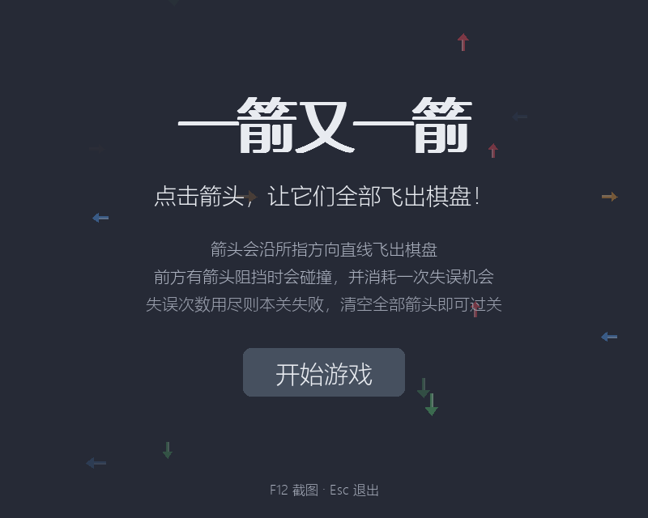
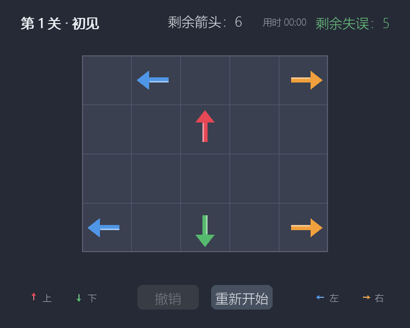
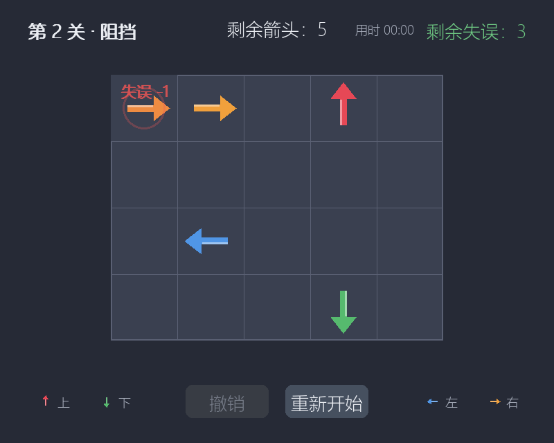
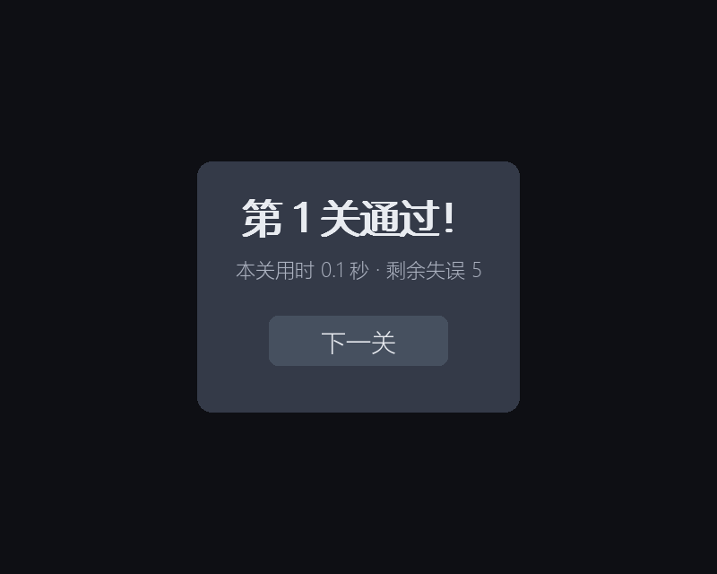
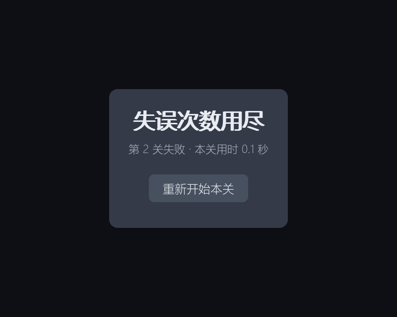
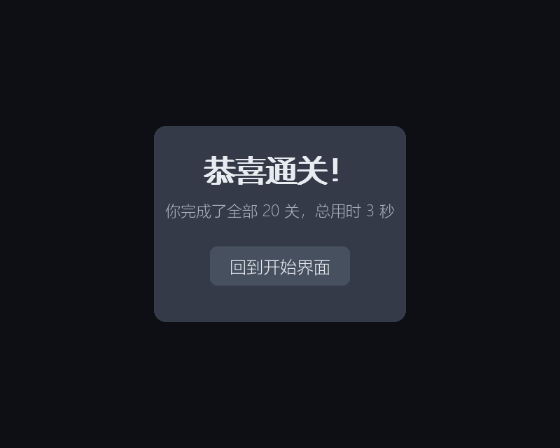

# 软件工程第二次个人作业——利用 AIGC 完成"一箭又一箭"小游戏

> 本文件是博客草稿。发布前请把表格里的课程链接、作业链接、学号、GitHub 仓库地址替换成你自己的信息，并按实际经历润色"心得体会"与 PSP 表格。

| 项目 | 内容 |
|---|---|
| 这个作业属于哪个课程 | <课程链接>（待填） |
| 这个作业要求在哪里 | <作业链接>（待填） |
| 这个作业的目标 | 使用 Python 和 AIGC 完成"一箭又一箭"小游戏 |
| 学号 | XXXXXXXX（待填） |
| GitHub 仓库 | https://github.com/chirp77/arrow-game |

---

## 一、项目展示













（建议再录一段 10~20 秒的演示 GIF：通关一关 + 故意点一次被挡箭头。可用 ScreenToGif 等工具录制，或在游戏里按 F12 连续截图后合成。）

## 二、项目介绍

### 游戏规则

- 棋盘是网格，格子中放着四种方向的箭头（上红、下绿、左蓝、右橙）；
- 玩家点击某个箭头，程序检查它前进方向与棋盘边界之间是否还有其他箭头；
  - 无阻挡：箭头沿方向飞出棋盘并消失；
  - 有阻挡：箭头原地晃动并闪红提示碰撞，同时**消耗一次失误机会**；
- 失误次数耗尽 → 本关失败，可重新开始本关；清空全部箭头 → 通关进入下一关；
- 共 20 关，全部通关显示通关结果与总用时。

### 界面设计

- 开始界面：漂浮箭头装饰背景、标题与规则依次淡入、"开始游戏"按钮；
- 游戏界面：顶部状态栏（关卡名 / 剩余箭头 / 剩余失误 / 用时，失误数按绿→黄→红分色警示）、居中棋盘、底部"撤销"与"重新开始"按钮、方向颜色图例；箭头按方向着色，悬停有高光；
- 结果界面：半透明遮罩 + 弹出动画的卡片式结果框（通关 / 失败 / 全部通关），通关卡片显示本关用时。

### 主要功能与特色

- 四种方向箭头、阻挡判定、碰撞反馈、失误机制、20 个可通关关卡（全部经 DFS 求解器验证）；
- 附加功能：撤销上一步、每关计时（关卡结束时冻结）、飞出拖尾粒子、碰撞冲击环与"失误 -1"飘字、程序生成音效（飞出"嗖"、碰撞"咚"、通关琶音、失败下行音）、打包为免 Python 环境的 exe；
- 全部图形用 pygame 基本图形绘制、全部音效用标准库合成，不依赖任何外部素材，无版权风险。

## 三、实现思路

### 3.1 数据表示

- 棋盘：二维字符列表，`'U'/'D'/'L'/'R'` 表示上/下/左/右箭头，`'.'` 表示空格（ASCII 字符规避 Windows 控制台编码问题）；
- 方向向量表：`{"U": (-1,0), "D": (1,0), "L": (0,-1), "R": (0,1)}`；
- 关卡数据：`{"name", "grid", "max_mistakes"}`，每关失误上限不同，由易到难。

### 3.2 路径检测（核心）

从被点箭头出发沿方向逐格前进，**先查界、后取值**，走出棋盘即畅通：

```python
def has_clear_path(grid, r, c) -> bool:
    dr, dc = DIRS[grid[r][c]]
    nr, nc = r + dr, c + dc
    while 0 <= nr < rows and 0 <= nc < cols:   # 先查界，绝不越界
        if grid[nr][nc] != EMPTY:
            return False                       # 前进方向上有其他箭头
        nr, nc = nr + dr, nc + dc
    return True                                # 走出棋盘，一路无阻挡
```

紧贴边缘朝外的箭头（如第 0 行的 ↑）第一步就出界，直接判定畅通，不需要任何特判。

### 3.3 判定在前、动画在后

点击瞬间 `try_remove()` 立即完成消除或扣失误，动画只做视觉反馈。这样无论动画怎么表现，规则状态都是确定的；动画期间冻结全部输入，防止连点导致重复扣分。飞出动画结束后检查是否清空棋盘，晃动动画结束后检查是否失误耗尽，再切换场景。

### 3.4 其他设计

- 剩余箭头数每次扫描盘面现算、不维护计数器，撤销和重开不会出现数字不同步；
- 撤销用 LIFO 栈记录成功消除的 (位置, 箭头)，只回退最近一次，不影响失误数；
- 关卡可解性：内置 DFS 回溯求解器，测试中逐关验证有解、并按解序列逐步重放，杜绝"实际上无法通关"的关卡混入；
- 动画基于时间（毫秒）驱动并截断 dt，窗口拖拽恢复后不会瞬跳；
- 中文字体逐级回退（微软雅黑 → 黑体 → 宋体），音频初始化失败时静默降级。

## 四、AIGC 使用过程

本次作业全程使用 **Claude Code** 辅助开发。以下是 6 次有代表性的协作记录（均来自真实开发过程）：

| 子任务 | 借助何种 AIGC 技术 | AI 实现或提供了什么 | 效果如何 | 人工修改 |
|---|---|---|---|---|
| 需求分析与方案设计 | Claude Code（含规划子代理） | 解读作业要求；先提问确认范围（Git/GitHub 延后处理、附加功能选定音效+撤销）；输出完整架构方案：逻辑与渲染分离、路径检测算法、两级状态机（场景+动画）、5 个关卡布局、测试方案 | 方案质量高，几乎可直接照做 | 基本未改，采纳了"判定在前动画在后"、"剩余箭头现算"等要点 |
| 环境搭建与依赖排错 | Claude Code | 用 uv 搭建 Python 3.12 + pygame + pytest 环境；遇到目录名含中文导致 `uv init` 报错、Python 3.14 下 pygame 无预编译包导致源码编译超时两个问题 | AI 独立定位并解决（改名参数、固定 3.12 版本） | 无，确认操作即可 |
| 核心逻辑与单元测试 | Claude Code | 生成 game_core.py 路径检测/失误/撤销代码与 T01–T09 单元测试，18 项一次通过 | 基本正确 | AI 写的死锁测试用例 `["R","L"]` 实际有解（1 列盘 R 直接出界），运行测试发现后改为 `["RL"]` 等真死锁盘——AI 的测试本身也要被验证 |
| 关卡设计与可解性验证 | Claude Code | 设计 5 关布局并给出每关教学点；写 DFS 求解器逐关验证 | 5 关全部有解，解序列与预期一致 | 规划阶段的第 2 关分析有疏漏（(0,1) 实际也被 (0,3) 阻挡），靠求解器输出的真实解序列核对修正了理解 |
| 界面/动画/音效与调试 | Claude Code | 生成全部界面场景、飞出/晃动动画、wave 合成音效与自检脚本 | 自检脚本一次性跑通全流程 | 自检发现"最后一关通关未直接进全部通关界面"的 bug，AI 修复流程分支；渲染测试里 AI 采样点选错（把箭头格当空格）被测试暴露后修正 |
| 第二轮优化：界面动效与 20 关扩充 | Claude Code | 重绘更纤细的箭头并加高光；实现飞出拖尾粒子、碰撞冲击环与"失误 -1"飘字；开始界面漂浮箭头与淡入、结果卡片弹出动画；HUD 失误分色警示、方向颜色图例、每关计时；设计 15 个新关卡 | 视觉反馈明显增强；20 关全部通过求解器验证，30 项测试全绿 | 求解器抓到 2 个新设计关卡存在死锁（同列 ↓↑ 相望、同排 →← 相望，永远无解），人工重新布局后才通过验证——再次说明 AI 设计的关卡必须逐关验证；渲染测试因新增入场动画需要先推进时间，同步修改了测试 |

**感受**：AI 提效明显，但输出并非总是对的——它的错误（测试用例写错、流程分支漏了最后一关）都需要靠"实际运行 + 测试"来暴露。提交的代码最终由本人负责，所以每一处关键代码我都读了一遍并能在上文中解释。

## 五、测试结果

### 自动化测试（pytest，30 项全部通过）

- `tests/test_game_core.py`（18 项）：路径检测、失误扣减、撤销、重开、边界情况；
- `tests/test_levels.py`（7 项）：关卡合法性、可解性、解序列逐步重放、死锁盘拒绝；
- `tests/test_rendering.py`（5 项）：像素级断言——棋盘/箭头颜色/HUD/遮罩/碰撞闪红/飞出动画。

### 作业要求的手工测试项目（由自检脚本 + 人工试玩共同验证）

| 编号 | 测试内容 | 预期结果 | 实际结果 | 是否通过 |
|---|---|---|---|---|
| T01 | 点击前方无阻挡的箭头 | 箭头飞出棋盘并消失 | 飞出动画后消失，剩余数 -1，失误不变 | 通过 |
| T02 | 点击前方有阻挡的箭头 | 箭头不消失，失误次数减 1 | 原地晃动闪红，失误 4→3，箭头保留 | 通过 |
| T03 | 点击位于边缘且朝向棋盘外的箭头 | 箭头正常消失，不发生越界错误 | 四种方向参数化测试全部正常消除，无异常 | 通过 |
| T04 | 消除本关全部箭头 | 显示通关并进入下一关 | 20 关依次通关，最后一关直接进入全部通关界面 | 通过 |
| T05 | 失误次数耗尽 | 显示失败并允许重新开始 | 显示失败界面，重开后盘面与失误数恢复 | 通过 |
| T06 | 游戏进行中重新开始 | 箭头布局和失误次数恢复 | 全部恢复初始状态，撤销栈清空 | 通过 |
| 附加 | 撤销上一步 | 恢复最近消除的箭头，不影响失误 | 箭头恢复、剩余数 +1、失误不变，栈空按钮置灰 | 通过 |
| 附加 | 点空格 / 棋盘外 | 零变化、不扣失误 | 状态无任何变化 | 通过 |
| 附加 | 动画期间连续点击 | 输入冻结，不重复扣分 | 动画期间点击被忽略 | 通过 |

另完成人工试玩：前 5 关实际通关。扩充到 20 关后，请再亲自试玩一遍全部关卡（可按 `python levels.py` 打印的求解器序列核对），再更新此句。

## 六、PSP 表格

> 下表"预估耗时"为开发前估计，"实际耗时"请按你自己的真实时间填写后计算差异。

| 任务 | 预估耗时（小时） | 实际耗时（小时） | 差异（小时） |
|---|---|---|---|
| 需求分析与游戏设计 | 2 |  |  |
| Python 与图形库学习 | 3 |  |  |
| 游戏界面实现 | 5 |  |  |
| 路径与碰撞逻辑实现 | 4 |  |  |
| 关卡设计 | 2 |  |  |
| AIGC 辅助开发 | 6 |  |  |
| 测试与修改 | 3 |  |  |
| README 与博客撰写 | 3 |  |  |
| 合计 | 28 |  |  |

## 七、心得体会

（以下为草稿，请结合自己的真实感受修改。）

1. **AI 是加速器，不是替代者。** 需求澄清、架构设计、代码生成、测试编写、bug 定位，每一步 AI 都能给出可用输出，开发效率提升明显。但 AI 的输出必须验证：本次开发中 AI 写的测试用例本身有错（把有解的盘面当死锁）、关卡分析有疏漏、流程分支漏了最后一关，都是靠运行测试和自检脚本发现的。
2. **测试先行收益很大。** 核心逻辑先写单元测试再实现（其实这次是同步完成的），T01–T09 一次全绿；关卡用求解器做"可解性门禁"，新增关卡必须先过测试，从机制上杜绝"无法通关的关卡"。
3. **逻辑与渲染分离让调试变简单。** 规则判定全部在纯 Python 模块里，不依赖 pygame，可以在无窗口环境跑测试；界面层只做转发与绘制。selftest 用 dummy 驱动不开窗口走完整流程并截图，验收和截图一次完成。
4. **对代码的理解是底线。** 作业要求"基本理解自己提交的代码"。我重点吃透了路径检测（先查界后取值）、判定与动画的顺序、撤销栈这三个关键点，助教提问时可以解释清楚。
5. **过程记录让 AIGC 使用"真实"。** 作业要求记录真实开发过程，边开发边记录比事后编造容易得多，也更有说服力。
